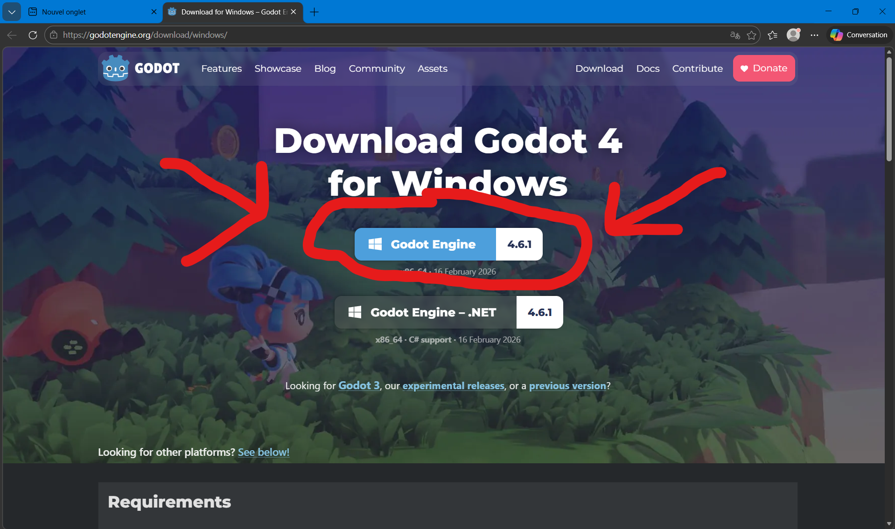

<h4 align="Center">0SH - Gestion de projet (2026)</h4>

<h1 align="center">SpellStack</h1>

### Description du produit final

- SpellStack, Utilisez la magie pour vaincre les forces du mal.

- Decouvrir tous les sorts afin de remplir votre grimoire.

- Combiner les sorts pour créer le sort ultime!

### Procédure d'installation

1. Dirigez vous vers ce lien et installez la version indiquée : https://godotengine.org/download/windows/
   

2. Dans vos fichiers locaux (téléchargements), allez chercher le fichier ZIP Nommé _Godot_v4.6.1-stable_win64.exe_ et Extraire le contenu vers un dossier de votre choix.

3. Exécutez le fichier exécutable _Godot_v4.6.1-stable_win64_ pour installer Godot.

4. Sur la page Github, dans la branche Main, allez copier l'url web du repositoire Git.

5. Dans vos fichiers locaux, à l'emplacement désirédes fichiers du jeu, appuyez sur _Clic droit_ dans le dossier et appuyez sur _Ouvrir dans le terminal_.

6. Une fois dans le terminal, Exécutez la commande suivante : git clone [L'url copié auparavent].

7. Retournez dans l'application Godot, et appuyez sur _Importer_ dans le coins suppérieur gauche de l'écran.

8. Naviguez vos fichiers locaux afin de trouver le fichier .godot que vous venez de clone dans le dossier choisi. Séléctionnez ce fichier et démarez le projet.

9. Appuyez sur _Lancer le projet_ dans le coins suppérieur droit de l'écran ou sur F5 afin de démarer le jeu.

